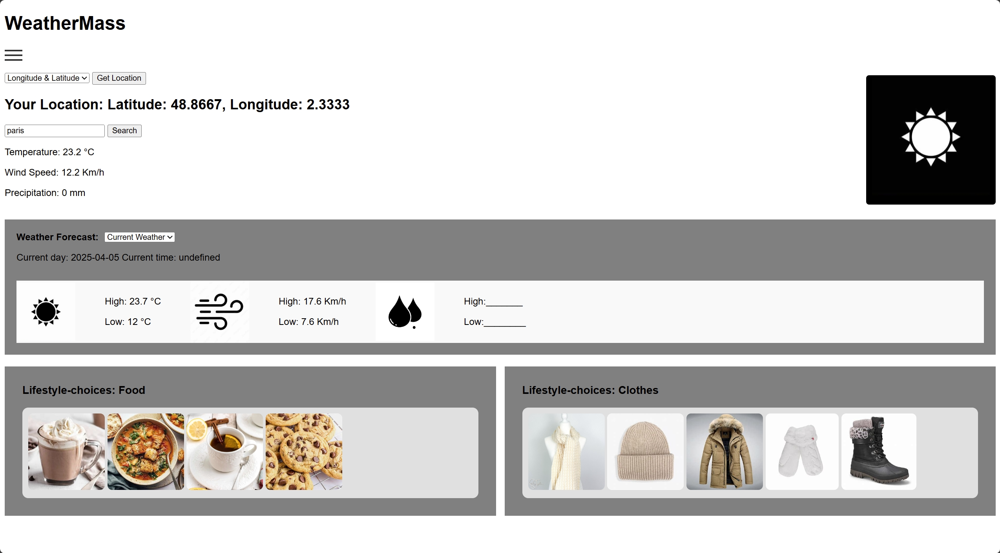

# 🌦️ WeatherMass

WeatherMass is a dynamic and visually engaging weather application that displays real-time weather data and forecasts based on city or geographic coordinates. It includes lifestyle suggestions such as foods and clothes tailored to the current weather. Built with HTML, CSS, JavaScript, and enhanced using Nunjucks templating for maintainability.

## 🧩 Features

- 🌍 Get weather by **city name** or **coordinates**
- 🌡️ Displays **temperature**, **wind speed**, and **precipitation**
- 🕓 Toggle between **current**, **hourly**, and **weekly** forecasts
- 🧥 Weather-specific lifestyle choices (clothing & food suggestions)
- 📊 Customizable units (°C/°F, Km/h/Mph, mm/inches)
- 📱 Responsive UI with dropdown navigation
- 🔁 Real-time updates across all weather sections on search
- 🧠 Modularized HTML using **Nunjucks** templating engine

## 📁 Project Structure

```
weathermass/
├── views/
│   ├── index.njk
│   ├── weather.njk
│   └── layouts/
│       ├── base.njk
│       ├── header.njk
│       ├── dropdowns.njk
│       └── footer.njk
├── public/
│   ├── Styling.css
│   └── pictures/
│       ├── sun.jpg
│       ├── wind.jpg
│       ├── drop.jpg
│       ├── Hot-chocolate.jpg
│       └── ...
├── fetch/
│   └── MainFormFetch.js
├── app.js
└── README.md
```

##  Getting Started

### 1. Clone the repository
```bash
git clone https://github.com/yourusername/weathermass.git
cd weathermass
```

### 2. Install dependencies
```bash
npm install express nunjucks
```

### 3. Run the development server
```bash
node app.js
```
Then visit `http://localhost:3000` in your browser.

## 🔧 Customize

You can adjust:
- Weather API endpoints in `MainFormFetch.js`
- Metric conversions or new units
- Additional lifestyle choices with images and logic
- Style using the `Styling.css` file

## 📦 Tech Stack

- **Frontend**: HTML, CSS, JavaScript
- **Templating**: [Nunjucks](https://mozilla.github.io/nunjucks/)
- **Backend**: Node.js with Express
- **API**: WeatherAPI or OpenWeather (based on integration)

## 🖼️ Preview



## 📜 License

MIT License. Use freely and modify as needed.

---
### Future Features

- Drag-and-drop 3D models based on weather (e.g., hot chocolate, scarf)
- User location auto-detection on page load
- Save favorite cities or weather preferences

---
### Author

**Supreme Emhenya**  
[GitHub](https://github.com/Emya101) • Based in Winnipeg, MB  
BSc. in Applied Computer Science from University of Winnipeg  
```
---
